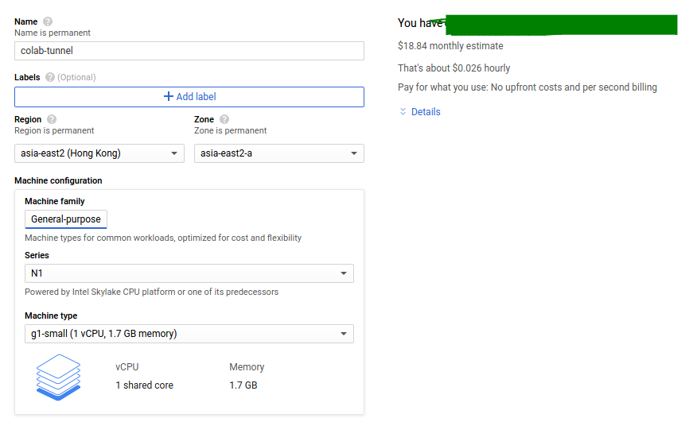
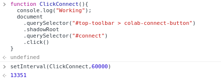

# Setup ngrok server và sử dụng colab như một remote server

## Table of Contents
* [About the Project](#about-the-project)
* [Getting Started]()
    * [Prerequisites]()
* [Setup server]()
    * [Create an vm-instace on Google cloud engine]()
    * [Install ngrok docker on the vm-instance]()
* [Setup on Colab notebook]()
* [Results]()
* [Contact]()
* [Acknowledgements]()


## About the Project

Trong qúa trình làm việc sử dụng Google colab, mình gặp một vấn đề rất khó chịu là Colab sử dụng Jupyter Notebook để làm 
việc. Một số vấn đề có thể kể đến là:

- **Code xấu:** Code cả project trong chỉ một notebook của colab thì nó xấu vch, chưa kể là cái gợi ý function của nó cũng
chậm làm giảm năng suất code, không phê được như Pycharm. Có thể khắc phục bằng cách là code ở local 
và push lên github sau đó clone về colab. Cách này code đẹp tí nhưng bắt tay vào làm thì hơi cực chứ không dễ.
  
- **Khó debug:** Bạn nào đã từng sử dụng Pycharm ở các máy local thì sẽ thấy n kỳ diệu thế nào.

- **Sử dụng terminal không linh hoạt:** Sử dụng terminal trong colab sida sau cái code xấu vừa chậm vừa khó nhìn. 
Mỗi lần muốn chạy một câu lệnh mới là xóa cell hiện tại đi hoặc phải tạo một cell mới
 
- **Phải lưu kết quả vào google drive:** Tốn dung lượng drive. Phức tạp khi code và sử dụng.
- **Khó theo dõi được Tensorboard**
- ......

Trong project này mình sẽ chia sẻ một cách làm việc hiệu quả với Google colab cho các bạn mới sử dụng colab. Một số chức năng được 
cung cấp:
- ssh vào colab và thao tác trên terminal với độ trễ thấp.
- Code và debug với Pycharm ở local và tự động đồng bộ code lên colab server.
- Tự động download các kết quả(checkpoint, log,...) về local thay vì phải lưu vào 
drive.
- Theo dõi Tensorboard từ local browser, hoặc bất kỳ thiết bị nào truy cập được internet.

## Getting started
### Prerequisites

Để thực hiện project này thì sẽ cần:
- Một server với IP tĩnh. Để demo mình sẽ sử dụng một máy ảo trên google cloud(Các bạn ra 
ngân hàng đăng ký một thẻ debit, dùng thẻ này để đăng ký sẽ được $300 free trong vòng một năm).
- Sử dụng linux terminal cơ bản.
- Máy tính để code. Laptop mình sử dụng có tuổi đời 7 năm, ram 4Gb.


## Setup server
### Tạo máy ảo trên google cloud
Mình tạo ra một máy ảo *g1-small 1vCPU, 1.7 GB memory* ở khu vực Hongkong với giá khoảng  ~598 VNĐ/H. Quá rẻ cho một cuộc tình.

Hệ điều hành mình sử dụng ở đây là Ubuntu-16.04


 
### Config and setup server:
- Cấu hình server để mở các port: 7000, 8000, 8001, 4443, 10000-10050 để sử dụng. Phần này các bạn có thể google để setup.
- Cài đặt docker. Đây là [hướng dẫn cài đặt](https://www.digitalocean.com/community/tutorials/how-to-install-and-use-docker-on-ubuntu-16-04) trên Ubuntu-16.06

### Build and run ngrok server:

Đầu tiên là clone code về:
```
git clone https://github.com/tanle2694/ssh_colab
```

Build docker và run ngrok server:
```
cd ssh_colab
chmod +x run_docker.sh
./run_docker.sh
```

Kiểm tra lại kết quả bằng câu lệnh 
```
docker ps
```
Nếu thành công thì kết quả sẽ hiện ra là có một docker đang chạy như hình bên 
dưới


### Expose ports of Colab:

**Bước 1:** Tạo một file Colab notebook giống như trong file colab của mình trong [link](https://colab.research.google.com/drive/1Fmm5Ry_mjw69pUi_2y3wWJqzmaOROdvw?usp=sharing) 

**Bước 2:** Cấu hình các tham số trong Colab notebook

**Cell 1:**
```
%%writefile /tmp/ngrok-config
server_addr: colab.tunnel:4443
trust_host_root_certs: false
tunnels:
  ssh-app:
    remote_port: 10004
    proto:
      tcp: 22
  tensorboard-app:
    remote_port: 10006  
    proto:
      tcp: 6006    
```
Các bạn setup các thông số từ dòng tunnels trở xuống. 
Ở đây là mình setup 2 tunnel:
- *ssh-app:* dùng để map cổng 10004 trên ngrok server và cổng 22 trên máy Colab
- *tensorboard-app:* map cổng 10006 trên ngrok server và cổng 6006 trên máy Colab

Nếu các bạn muốn map các cổng khác thì có thể thêm vào bên dưới với format:
```
app-name:
  remote_port: xxx
  proto:
    tcp: yyy
```  

**Cell 2:**
```
function ClickConnect(){
  console.log("Working"); 
  document
    .querySelector("#top-toolbar > colab-connect-button")
    .shadowRoot
    .querySelector("#connect")
    .click()
}

setInterval(ClickConnect,60000)
```
Trong quá trình run Colab notebook, nếu không có thao tác gì với notebook thì session có thể bị mất kết nối.

Để giải quyết vấn đề này, đầu tiên hãy ấn phím F12, và copy nội dung trên vào console của trình duyệt như sau:
 


Sau 60s đoạn mã này sẽ tự động ấn nút connect để tránh bị ngắt kết nối của session

**Cell 3:**
```
import os
os.environ['IP_SERVER'] = "35.186.148.224"
os.environ['SSH_KEY'] = "ssh-rsa AAAAB3NzaC1yc2EAAAADAQABAAABAQDGB10CfGiSci1JqI1LkwRUv13kGBlhf0zD2GRkKz6ixpzb3F9AN40tB7s+oqwqCoD6puB6B8e/RUnRbqTefNyMN3rhMzCzLK+nWZHqZF9D0HV/1ngxvu+R1SZjFdasJ52kRm1l8z6OAy+CHglYgG3a/qkzEOkfoMt3CKkNwCy6O6FxYi2Kzr12OfcPsySUByBlZv1G7TIEA4sl0IIYoPhgu5IM2gLXEQcvJZO6TGMgTV+yzh1/oZamQo/JB4SRYQERhe8bFCjqbEwACT3+H1pfTU0sWQbhcB/mLhZU9Ide7XV9Xr+3vp8VOyvVuV+5WjOcquaPLM6ieVaT90zBPweT tanlm@tanlm"
os.environ['APP_RUN'] = "ssh-app tensorboard-app"
os.environ['TAG'] = "v1.0"
```
- IP_SERVER: public IP của ngrok server chúng ta đã sử dụng
- SSH_KEY: ssh public-key của máy local
- APP_RUN: ở đây mình chạy 2 app đã đăng ký là *ssh-app* và *tensorboard-app*
- TAG: tag của code trên github. Phần này các bạn không cần sửa đổi